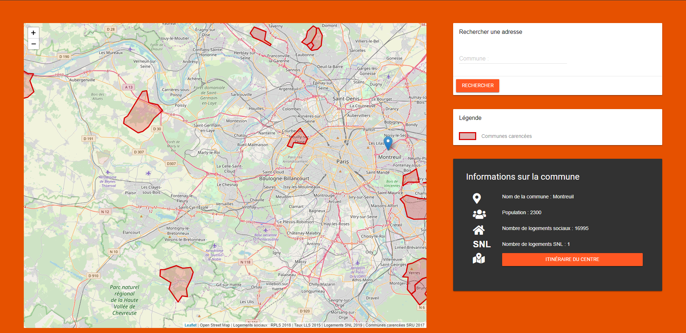

# Logement Social IDF

Logement social IDF est une application web qui permet de consulter des données à propos de l'état du logement social dans les communes d'Ile de France.

## Fonctionnalités

* Indiquer les communes d’île de France n’ayant pas une proportion assez importante de logements sociaux par rapport au nombre d’habitant selon la loi solidarité et renouvellement urbains du 13 décembre 2000
* L’utilisateur peut aussi sélectionner n’importe quelle ville d’île de France sur la carte, ou en indiquant son nom dans la barre de recherche, afin d’obtenir certaines informations, comme le nombre d’habitants, ou le nombre de logements sociaux.  
* Après avoir sélectionné une ville l’utilisateur peut aussi avoir le temps de trajet ainsi que l’itinéraire entre le point sélectionné et la station Chatelet, afin d’avoir une idée de l’isolement de la ville. 
* En dessous de la carte, on peut voir une liste d’articles de lois concernant les logements sociaux en France

## Provenance des données

Nous avons récupéré toutes les données des logements sociaux sur le site data.gouv.fr et en avons importées dans le projet dans le répertoire donné. Pour tout ce qui est données les API adresse.data.gouv.fr et navitia.io du STIF. 

## Bibliothèques et outils

Bibliothèques et Outils 
Nous avons utilisé le framework CSS Material Design Lite pour le style de l’interface. 
Pour la carte nous avons utilisé Leaflet et jQuery pour le code client.

La version de production actuelle est hébergée [ici](https://lapostolet.fr)